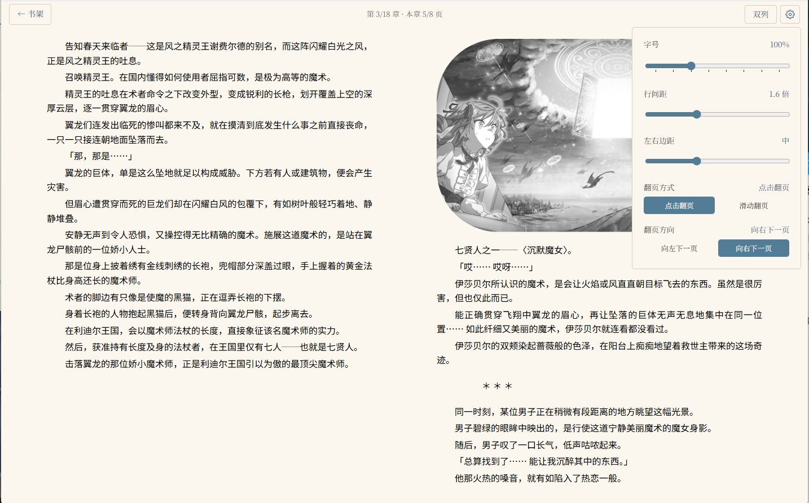
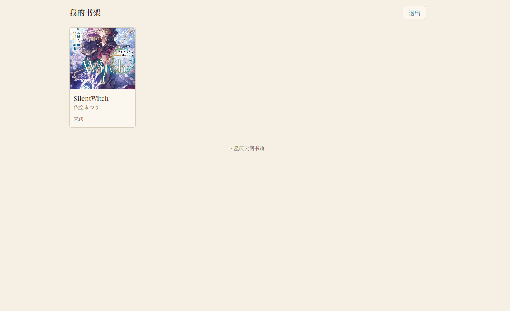
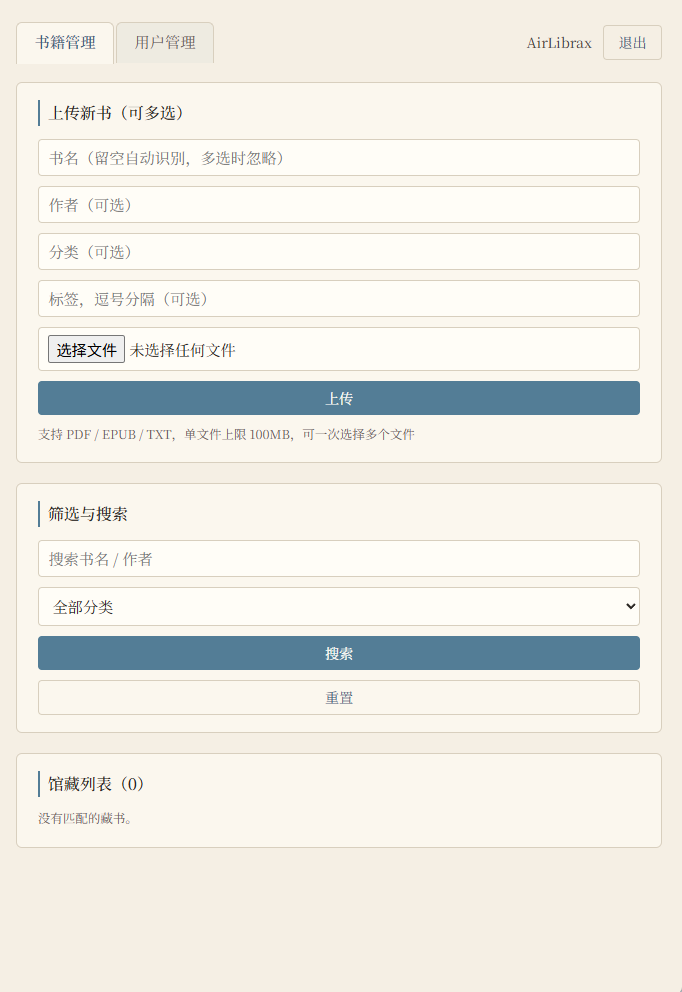
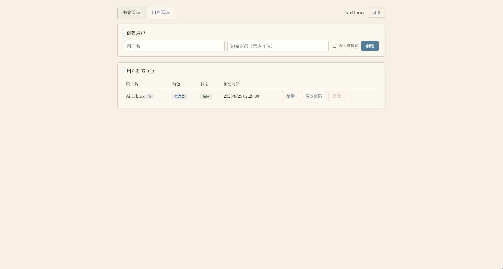

# StarCloud

A self-hosted personal cloud library: keep your books on your own server, read them from any browser or phone app, and keep your reading progress in sync across devices.



## Features

- **Read on any device** — web reader (TXT / PDF / EPUB) + Android app + admin console, all sharing the same interaction model
- **Cross-device progress sync** — EPUB progress is saved with a precise **CFI bookmark**, so reopening a book drops you exactly where you left off (down to the paragraph); TXT/PDF restore by scroll ratio / page
- **Page-level indicators** — the reader shows "Chapter x/y · Page a/b of this chapter", consistent across web and mobile
- **Whole-book percentage** — EPUB lazily generates locations in the background (without interrupting reading) to give an accurate reading percentage across chapters
- **Self-hosted** — all data lives on your server (single-file SQLite + book files); optional invite-code gate for public registration
- **Offline reading** (App) — import EPUB/TXT locally and read without network; cloud books can be downloaded for offline use
- **Multi-format** — EPUB / PDF / TXT; EPUB cover, title, author, and volume are parsed automatically on upload
- **Lightweight deployment** — Docker + Caddy brings up the whole stack with automatic HTTPS

## Project status

| Module | Status | Description |
|--------|--------|-------------|
| `apps/server` Backend API | ✅ Done | Auth / books / progress / user management, single-file SQLite storage |
| `apps/admin` Admin console | ✅ Done | Login, user management, book upload & editing, categories/tags/search, cover management, batch operations |
| `apps/reader` Web reader | ✅ Done | TXT / PDF / EPUB; interaction system implements the frozen spec (see [docs/reader-interaction.md](docs/reader-interaction.md)) |
| `apps/mobile` Android app | ✅ Done | Expo + RN; local import + cloud shelf + offline EPUB/TXT + tablet landscape two-column; TODO: offline PDF |
| `deploy/` Production deployment | ✅ Done | Docker + Caddy one-command deploy, auto HTTPS, backup guide (see [docs/deploy.md](docs/deploy.md)) |

## Quick start

Requires Node.js ≥ 20.

```bash
npm install                      # install all workspace dependencies

# First-time database & admin setup
cd apps/server
cp .env.example .env             # on Windows: copy .env.example .env
#   ↓ edit .env: at least replace JWT_SECRET with your own random string
npx prisma migrate dev           # create database tables
cp prisma/admins.example.json prisma/admins.json
#   ↓ edit admins.json: initial admin username & password (JSON array, multiple allowed)
npm run seed                     # create initial admin from admins.json (idempotent)
cd ../..
```

> `seed` only reads `prisma/admins.json` (gitignored). It refuses to run with exit code 1 when the file is missing, corrupted, or missing required fields — the code contains no default credentials.

Start the backend (port 3000):

```bash
npm run dev:server
```

In a second terminal, start the frontends (in dev mode, `/api` and `/uploads` requests are proxied by Vite to the backend):

```bash
npm run dev:admin                # admin console  http://localhost:5173
npm run dev:reader               # web reader     http://localhost:5174
```

Android app (dev mode — install Expo Go on your phone, scan the QR code or enter the LAN address):

```bash
npm run dev:mobile               # expo start --lan
```

In the app's Settings screen, enter the server address and log in to use the cloud shelf; without configuring a server it works as a fully offline local reader. Both the Settings screen and the login screen offer a registration entry, consistent with the web side.

## Architecture

npm workspaces monorepo, full-stack TypeScript, one shared type & interaction model across all four packages:

```
StarCloud/
├── apps/
│   ├── server/                      Backend API (NestJS 11 + Prisma 6 + SQLite)
│   │   ├── src/
│   │   │   ├── main.ts              Nest bootstrap: global validation pipe, upload dir, static hosting
│   │   │   ├── app.module.ts        Root module: business modules + static hosting (uploads / admin dist)
│   │   │   ├── auth/                Login, self-registration (optional invite gate), JWT issuance
│   │   │   │   ├── auth.controller.ts   /api/auth/* routes
│   │   │   │   ├── auth.service.ts      credential check, JWT issuance, registration
│   │   │   │   ├── invite-gate.ts       invite-code gate (reads INVITE_CODE env var)
│   │   │   │   ├── jwt-auth.guard.ts    "authenticated" guard (Bearer / ?access_token=)
│   │   │   │   ├── admin.guard.ts       "admin" guard
│   │   │   │   └── dto/                 login / register request validation
│   │   │   ├── books/                Book CRUD, upload, covers, categories/tags, batch delete
│   │   │   │   ├── books.controller.ts  /api/books/* routes
│   │   │   │   ├── books.service.ts     core: file storage, metadata editing, search, batch delete
│   │   │   │   ├── epub-meta.ts         EPUB zip parsing (cover / title / author / volume heuristic)
│   │   │   │   └── dto/                 upload / edit / batch-delete validation
│   │   │   ├── progress/            Reading progress
│   │   │   │   ├── progress.controller.ts  POST /api/progress, GET /api/shelf
│   │   │   │   └── dto/                  validation (currentPage/totalPages/position CFI/percentage)
│   │   │   ├── users/               User management (admin) and self password change
│   │   │   ├── prisma/              Prisma client singleton (global module)
│   │   │   └── types/               Express type augmentation (req.user etc.)
│   │   └── prisma/
│   │       ├── schema.prisma        Data model: User / Book / Tag / ReadingProgress
│   │       ├── seed.ts              Initial-admin seeding (reads admins.json; paths in prisma/ and dist/ both supported)
│   │       ├── admins.example.json  Admin credential template (copy to admins.json)
│   │       └── migrations/          All database migrations (5, incl. add_progress_position)
│   │
│   ├── admin/                       Admin console (Vite 7 + React 19 + TypeScript)
│   │   ├── src/
│   │   │   ├── main.tsx             Entry
│   │   │   ├── App.tsx              Routes (login / books / users)
│   │   │   ├── auth-context.tsx     Auth state (JWT storage, route guards)
│   │   │   ├── api/client.ts        Backend request wrapper (token, unified errors)
│   │   │   ├── pages/
│   │   │   │   ├── LoginPage.tsx    Admin login
│   │   │   │   ├── BooksPage.tsx    Book management: upload, edit, covers, tags, batch delete, search
│   │   │   │   └── UsersPage.tsx    User management: create/edit/disable/delete/reset password
│   │   │   └── styles.css           Global styles
│   │   └── vite.config.ts           Dev proxy (/api, /uploads → :3000)
│   │   └── Production build is served by the backend, same origin as the API
│   │
│   ├── reader/                      Web reader (Vite 7 + React 19 + epubjs)
│   │   ├── src/
│   │   │   ├── main.tsx             Entry
│   │   │   ├── App.tsx              Routes (login / shelf / reader)
│   │   │   ├── auth-context.tsx     Auth state
│   │   │   ├── api/client.ts        Backend request wrapper
│   │   │   ├── components/
│   │   │   │   └── EpubViewer.tsx   EPUB renderer: epubjs wrapper, paging/two-column/settings/progress/CFI restore
│   │   │   ├── pages/
│   │   │   │   ├── LoginPage.tsx    Login/register (auto-detects invite gate)
│   │   │   │   ├── ShelfPage.tsx    Shelf: book list, search, category filter, progress
│   │   │   │   └── ReaderPage.tsx   Reader: format dispatch (EPUB renderer / PDF iframe / TXT scroll)
│   │   │   └── styles.css           Global styles
│   │   └── vite.config.ts           Dev proxy
│   │
│   └── mobile/                      Android app (Expo 57 + React Native 0.86)
│       ├── app.json                Expo config: icons, adaptive icons, splash (expo-splash-screen plugin),
│       │                           package id, version, cleartext traffic flag
│       ├── eas.json                EAS build config (preview=APK / production=AAB)
│       ├── index.tsx                Entry
│       ├── metro.config.js         Metro config (vendor asset handling)
│       ├── assets/
│       │   ├── images/             icon / adaptive icon set / splash images
│       │   └── vendor/             inlined epubjs & jszip sources (offline EPUB engine)
│       └── src/
│           ├── App.tsx             Navigation stack + auth state
│           ├── theme.ts            Color theme
│           ├── api/
│           │   ├── client.ts       Backend wrapper (progress reports carry position/percentage)
│           │   └── file-cache.ts   Cloud file local cache (offline download)
│           ├── reader/
│           │   └── offline-epub.ts Offline EPUB shell page: inlined engine, gesture bridge,
│           │                       CFI restore (with second-pass calibration), lazy locations, progress reporting
│           ├── screens/
│           │   ├── LibraryScreen.tsx  Shelf: local + cloud books, download, progress
│           │   ├── ReaderScreen.tsx   Reader: EPUB (WebView) / TXT (native) / PDF, settings panel
│           │   ├── LoginScreen.tsx    Login (registration entry)
│           │   ├── RegisterScreen.tsx Register (adapts to invite gate)
│           │   └── SettingsScreen.tsx Settings: server address, theme
│           └── storage/
│               ├── local-books.ts   Local book library persistence (AsyncStorage, incl. progress/CFI)
│               ├── reading-prefs.ts Reading preferences (font/line-height/margin/page-mode/axis/direction/two-column)
│               └── settings.ts      Server address etc.
│
├── packages/
│   └── shared/                      Shared types & reading interaction model (zero runtime deps)
│       └── src/
│           ├── book.ts             Book / UserPublic entity types
│           ├── progress.ts         ReadingProgress / UpdateProgressRequest / ShelfItem
│           └── reading.ts          Single source of truth for reading interaction:
│                                   PageMode / SwipeLayout / VerticalStyle / SwipeDirection /
│                                   tapZoneAction() / step constants
│
├── deploy/                          Production deployment assets
│   ├── docker-compose.yml          starcloud (backend + admin console) + caddy (reader + reverse proxy)
│   ├── Dockerfile                  Multi-stage backend image (builds server/admin/reader + seed in stage 1)
│   ├── Caddyfile                   Caddy config: reader SPA at root, /api & /uploads reverse-proxied
│   ├── caddy.Dockerfile            Caddy image (reader static assets baked in)
│   └── .env.example                Production env template (JWT_SECRET / admin / domain)
│
├── docs/                            Documentation
│   ├── reader-interaction.md       Frozen reading-interaction spec (authoritative definition)
│   ├── deploy.md                   Full production deployment guide (Docker install → config → start → backup → troubleshooting)
│   ├── screenshots/                UI screenshots
│   └── archive/                    Historical specs (kept for reference)
│
├── Dockerfile                      Backend image definition used by deploy/
├── .dockerignore                   Build context excludes (node_modules, dist, .git, data)
└── package.json                    Workspace root: script orchestration (dev/build/typecheck/lint/seed)
```

### Reading interaction model (frozen spec)

Reading interaction is defined once in `packages/shared/src/reading.ts` — the single source of truth shared by web and mobile, never hardcoded per client:

- **Page-turn mode**: tap (left/right zones, meaning follows direction preference) / swipe
- **Swipe axis**: horizontal / vertical
- **Vertical style**: continuous (endless scroll, auto-advances to next chapter) / paged
- **Direction preference**: left-next (manga style) / right-next
- **Two-column layout**: enabled when viewport ≥768px, landscape-dominant (tablet landscape / desktop), and the preference is on; vertical swipe and desktop swipe are always single-column; keyboard paging has a 400ms anti-repeat cooldown
- **Precise EPUB bookmarks**: progress reports carry an epubjs CFI (paragraph-level precision); restoring uses `display(cfi)` to return to the exact spot; on mobile a second-pass calibration corrects paging offset after first render
- **Whole-book percentage**: on first open, locations are generated lazily in idle time (non-blocking); percentage falls back to chapter granularity until locations are ready

### Data flow

```
Browser / phone app
      │  HTTP + JSON（Authorization: Bearer <JWT>）
      ▼
NestJS backend (port 3000)
  ├─ AuthModule     POST /api/auth/login · POST /api/auth/register · GET /api/auth/registration · GET /api/auth/me
  ├─ BooksModule    GET/POST/PATCH/DELETE /api/books · GET /api/books/:id/download
  │                 POST/DELETE /api/books/:id/cover · POST /api/books/batch-delete
  ├─ ProgressModule POST /api/progress · GET /api/shelf
  ├─ UsersModule    GET/POST/PATCH/DELETE /api/users · POST /api/users/change-password
  │                 POST /api/users/:id/reset-password
  ├─ Serves /uploads static files and admin/dist (single process in production)
  └─ Prisma → SQLite (apps/server/prisma/data/starcloud.db)
```

Production (Docker):

```
Public (80/443 or non-standard port)
      │
      ▼
Caddy (reader SPA static hosting + auto HTTPS)
      │  /api/*, /uploads/* reverse-proxied
      ▼
starcloud container (NestJS + SQLite, listens only on 127.0.0.1:3000)
      └─ volumes: deploy/data/db (database), deploy/data/uploads (books & covers)
```

### Design decisions

- **Monorepo + shared types**: `Book` and friends are defined once; renaming a field anywhere fails the build everywhere.
- **One interaction model, three clients**: paging/swipe/direction/tap-zone semantics live only in `@starcloud/shared/reading.ts` (incl. `tapZoneAction()`); step constants (font/line-height/margin) and the persistence keys (`starcloud.*`) match across clients.
- **Dual token channels**: JWT from `Authorization: Bearer` by default; `?access_token=` fallback for iframes (PDF viewing) that cannot send custom headers.
- **Upload validation**: mimetype whitelist first (PDF / EPUB / TXT); any unrecognized mimetype falls back to the file extension (still whitelisted); rejected files are cleaned up immediately, no orphans.
- **Automatic EPUB metadata**: parses the OPF inside the zip on upload — cover, embedded title, author; volume detected heuristically from title/filename (第N卷 / Vol.N / trailing number).
- **Typography**: 8 font sizes, 4 line-heights, 4 margins — discrete steps, persisted locally; line-height is injected with `!important` into chapter iframes to override book CSS without clipping.
- **Offline EPUB on mobile**: epubjs/JSZip assets are inlined into a WebView shell page; book data is pushed as base64 chunks and decompressed in base64 mode (no XHR, no data: URI limits); the gesture bridge only reports raw gestures — paging semantics are decided on the RN side with the shared model.
- **Progress never lost**: clients debounce 3s but flush on exit (unmount / pagehide with keepalive), so leaving right after a page turn still saves; percentage is only trusted when it's a valid positive number, preventing epubjs's 0 (before locations exist) from clobbering real progress.
- **Hard delete with cascade**: deleting a user cascades reading progress and nulls uploader references; "disable" (`isActive`) is the soft, data-preserving alternative. Deleting a book cascades progress and removes cover/book files.
- **Security conventions**: `.env` and `admins.json` are gitignored — real credentials never enter the repo; deployment assets ship `.example` templates only; in production the backend binds to localhost only, with Caddy as the sole public entry point.

## Tech stack

| Package | Stack |
|---------|-------|
| server | NestJS 11 · Prisma 6 · SQLite · JWT (@nestjs/jwt) · class-validator · multer · adm-zip (EPUB parsing) · fast-xml-parser |
| admin / reader | Vite 7 · React 19 · react-router-dom 7 · epubjs (reader only) |
| mobile | Expo 57 · React Native 0.86 · react-navigation 7 · react-native-webview · expo-splash-screen · expo-document-picker · @react-native-async-storage/async-storage |
| shared | TypeScript (pure types + constants/functions, no runtime dependencies) |

## Configuration

All backend configuration lives in `apps/server/.env` (not in the repo; `.env.example` is provided):

| Variable | Required | Description |
|----------|----------|-------------|
| `DATABASE_URL` | ✅ | SQLite path, relative to `prisma/`, default `file:./data/starcloud.db` |
| `JWT_SECRET` | ✅ | JWT signing secret; must be a long random string in production — leaking it means anyone can forge login sessions |
| `INVITE_CODE` | ❌ | Registration invite-code gate (see below); empty disables it |

Initial admin credentials live in `apps/server/prisma/admins.json` (gitignored; template `admins.example.json`). JSON array, multiple admins allowed:

```json
[
  { "username": "admin1", "password": "at-least-4-chars" },
  { "username": "admin2", "password": "another-password" }
]
```

> Security: `.env` and `admins.json` are gitignored; only their `.example` templates are committed.

### Invite-code gate (optional)

Self-registration is open by default. To restrict it, set an invite code in `apps/server/.env`:

```env
# non-empty = gate enabled: registration must carry a matching inviteCode, otherwise 403
INVITE_CODE="star2026"
```

- **Enable**: set a non-empty `INVITE_CODE` and restart the backend; the registration form automatically shows an "invite code" field (frontends probe `GET /api/auth/registration`, which only returns `{ inviteCodeRequired: boolean }` — the code itself is never exposed).
- **Rotate**: change the value and restart; the old code stops working immediately.
- **Disable**: empty the value (`INVITE_CODE=""`) or delete the line and restart.
- **Remove completely**: delete the `INVITE_CODE` line from `.env`; no code changes needed (the whole mechanism lives in `apps/server/src/auth/invite-gate.ts`).

> The gate only applies to self-registration (`POST /api/auth/register`); admins creating users from the console are unaffected.

## API reference

| Method | Path | Access | Description |
|--------|------|--------|-------------|
| POST | `/api/auth/login` | public | Login; returns JWT + user info |
| POST | `/api/auth/register` | public | Self-registration (requires `inviteCode` when the gate is on); logs in on success |
| GET | `/api/auth/registration` | public | Registration config: whether an invite code is required (never leaks the code) |
| GET | `/api/auth/me` | auth | Current user info |
| GET | `/api/books?q=&category=` | auth | Book list (reader count, category, tags); `q` fuzzy-matches title/author, `category` filters exactly |
| GET | `/api/books/:id` | auth | Book detail |
| GET | `/api/books/:id/download` | auth | Download file (query token supported) |
| POST | `/api/books` | admin | Upload book (multipart, field `file`, max 100MB; optional `category`/`tags` comma-separated) |
| PATCH | `/api/books/:id` | admin | Edit metadata (title/volume/author/description/category/tags; tags replaced wholesale) |
| POST | `/api/books/:id/cover` | admin | Upload/replace cover (png/jpeg/webp, max 10MB) |
| DELETE | `/api/books/:id/cover` | admin | Remove cover and delete file |
| POST | `/api/books/batch-delete` | admin | Batch delete (transactional; cleans files and progress; returns deleted/skipped) |
| DELETE | `/api/books/:id` | admin | Delete book with its files and cover |
| POST | `/api/progress` | auth | Report/update reading progress (with CFI `position` and optional `percentage`) |
| GET | `/api/shelf` | auth | My shelf (books + personal progress) |
| GET/POST | `/api/users` | admin | List users / create user |
| PATCH | `/api/users/:id` | admin | Edit username / role / enable-disable |
| DELETE | `/api/users/:id` | admin | Delete user (hard delete, progress cascades; cannot delete yourself) |
| POST | `/api/users/:id/reset-password` | admin | Admin sets a user's new password |
| POST | `/api/users/change-password` | auth | Change own password (requires old password) |

## Common commands

| Command | Purpose |
|---------|---------|
| `npm run dev:server` | Backend dev with hot reload (:3000) |
| `npm run dev:admin` | Admin console dev (:5173) |
| `npm run dev:reader` | Web reader dev (:5174) |
| `npm run dev:mobile` | Expo dev server (dev-client) |
| `npm run build` | Build all workspaces with a build script (server / admin / reader) |
| `npm run typecheck --workspace @starcloud/server` | Backend type check |
| `npm run typecheck --workspace @starcloud/admin` | Admin console type check |
| `npm run typecheck --workspace @starcloud/reader` | Web reader type check |
| `npm run typecheck --workspace @starcloud/mobile` | App type check |
| `npm run typecheck --workspace @starcloud/shared` | Shared package type check |
| `npm run lint` | Repo-wide ESLint (quality gate) |
| `npm run lint:fix` | ESLint with auto-fix |
| `npm run seed --workspace @starcloud/server` | Seed the initial admin |

## Deployment

Full production guide (Docker + Caddy, HTTPS, backup, troubleshooting): **[docs/deploy.md](docs/deploy.md)**.

Summary:

```bash
cd /opt/starcloud                        # git clone the repo on your server
cp deploy/.env.example deploy/.env       # set JWT_SECRET / admin / domain
docker compose -f deploy/docker-compose.yml up -d --build   # bring up the whole stack
docker compose -f deploy/docker-compose.yml exec starcloud node dist/seed.js  # seed admin
```

Production topology: one `starcloud` container (API + admin console + book files), one `caddy` container (reader SPA + reverse proxy for `/api` and `/uploads`). Data lives under `deploy/data/` (database, books, certificates) — migrate by copying the directory.

**Pre-launch security checklist**:

- [ ] `.env` `JWT_SECRET` replaced with a long random string
- [ ] `prisma/admins.json` created with a non-template password
- [ ] Decide whether to enable the invite-code gate (recommended for public instances)
- [ ] Confirm `.env` and `admins.json` were not accidentally committed

## Screenshots

| | |
|---|---|
|  |  |
|  |  |
|  | |

## Documentation index

| Doc | Content |
|-----|---------|
| [docs/reader-interaction.md](docs/reader-interaction.md) | Frozen reading-interaction spec (authoritative across clients) |
| [docs/deploy.md](docs/deploy.md) | Full production deployment guide |
| [docs/archive/mobile-spec-v1.md](docs/archive/mobile-spec-v1.md) | Original mobile app spec (archived — all features implemented) |
| [README.md](README.md) | 中文文档 |

## History

The v1 prototype (Express + sqlite3 + plain-HTML admin pages) was fully rewritten into the current monorepo architecture.

## License

Licensed under the [GNU General Public License v3.0](https://www.gnu.org/licenses/gpl-3.0.html) (GPL-3.0). See the [LICENSE](LICENSE) file for the full text.

- SPDX: `GPL-3.0-only`
- Copyright (C) 2026 AirLibrax
