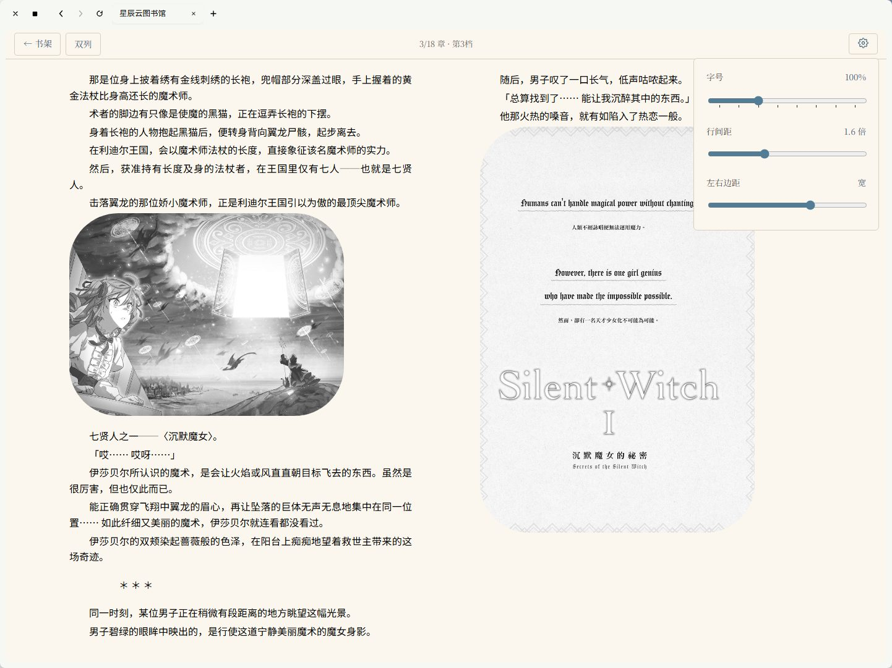

# 星辰云图书馆 StarCloud

个人云端图书馆：在服务器上存放书籍，在任何设备的浏览器或手机 App 中阅读，阅读进度跨设备同步。



## 项目状态

| 模块 | 状态 | 说明 |
|------|------|------|
| `apps/server` 后端 API | ✅ 完成 | 认证 / 书籍 / 进度 / 用户管理，SQLite 单文件存储 |
| `apps/admin` 管理后台 | ✅ 完成 | 登录、书籍上传（PDF / EPUB / TXT）、列表、删除、读者数 |
| `apps/reader` Web 阅读端 | ✅ 完成 | TXT / PDF / EPUB 三格式；阅读交互体系已按冻结规格实现（见 [docs/reader-interaction.md](docs/reader-interaction.md)） |
| `apps/mobile` 安卓 App | ✅ 完成（第一版） | Expo + RN；本地导入 + 云端书架 + 离线 EPUB/TXT；交互已对齐 shared 模型（见 [docs/mobile-spec.md](docs/mobile-spec.md)）；平板横屏双列排版已支持；待办：PDF 离线 |
| 部署配置 | ⏳ 暂未完成 | 生产部署脚本与 HTTPS 配置待补充 |

## 架构

npm workspaces 单体仓（monorepo），TypeScript 全栈，四端共享一份类型定义与交互模型：

```
StarCloud/
├── apps/
│   ├── server/          ✅ 后端 API（NestJS 11 + Prisma 6 + SQLite）
│   │   ├── src/
│   │   │   ├── auth/        登录、JWT 签发、认证与管理员守卫
│   │   │   ├── books/       书籍上传（multipart）、下载、删除；
│   │   │   │                EPUB 元数据解析（封面 / 书名 / 卷数）
│   │   │   ├── progress/    阅读进度上报与「我的书架」聚合查询
│   │   │   ├── users/       用户管理（管理员）与改密
│   │   │   ├── prisma/      数据库客户端单例（全局模块）
│   │   │   └── types/       Express 类型扩充
│   │   └── prisma/
│   │       ├── schema.prisma    数据模型（User / Book / ReadingProgress）
│   │       └── seed.ts          默认管理员种子脚本
│   │
│   ├── admin/           ✅ 管理后台（Vite 7 + React 19 + TypeScript）
│   │   └── 构建产物由后端托管，部署后与 API 同域
│   │
│   ├── reader/          ✅ Web 阅读端（Vite 7 + React 19 + epubjs）
│   │   ├── EPUB: epubjs 渲染（EpubViewer），点击 / 滑动 / 键盘翻页，
│   │   │          上下滑动（无缝滚动 / 单页翻动）、单双列排版、方向偏好
│   │   ├── PDF:  浏览器原生渲染（iframe + query token）
│   │   └── TXT:  滚动式阅读，滚动位置换算进度
│   │   交互规格（翻页方式/轴向/方向/双列）见 docs/reader-interaction.md
│   │
│   └── mobile/          ✅ 安卓 App（Expo + RN）：
│                          双书源（本地导入 + 云端书架）、零多余权限、
│                          离线 EPUB（WebView 内嵌 epubjs + base64 分块推送）、
│                          TXT 原生渲染；阅读交互与 Web 端共享同一套
│                          @starcloud/shared 模型（见 docs/mobile-spec.md）；
│                          平板横屏双列排版已支持。待办：PDF 离线
│
├── packages/
│   └── shared/          ✅ 三端共用的 TypeScript 类型定义与阅读交互模型
│                          （Book / UserPublic / ReadingProgress 等类型；
│                          FONT_STEPS / LINE_HEIGHTS / MARGINS 档位；
│                          PageMode / SwipeLayout / VerticalStyle /
│                          SwipeDirection / tapZoneAction）
│
└── docs/                交互规格文档与效果图
```

### 阅读交互体系（冻结规格）

翻页交互是三端共享的唯一权威定义（`packages/shared/src/reading.ts`），
Web 与 App 不各自硬编码：

- **翻页方式**：点击翻页（tap，左右半区分区，含义随方向偏好）/ 滑动翻页（swipe）
- **滑动轴向**：左右滑动（horizontal）/ 上下滑动（vertical）
- **上下滑动样式**：无缝滚动（continuous，滚到底自动接下一章）/ 单页翻动（paged）
- **方向偏好**：向左下一页（left-next，日式漫画方向）/ 向右下一页（right-next）
- **双列排版**（Web）：视口 ≥768px 且横向占优（平板横屏/桌面）且开启双列偏好时生效；
  上下滑动 / 桌面滑动固定单列；键盘翻页带 400ms 防连击冷却

### 数据流

```
浏览器 / 手机 App
      │  HTTP + JSON（Authorization: Bearer <JWT>）
      ▼
NestJS 后端（端口 3000）
  ├─ AuthModule     POST /api/auth/login · GET /api/auth/me
  ├─ BooksModule    GET/POST/DELETE /api/books · GET /api/books/:id/download
  ├─ ProgressModule POST /api/progress · GET /api/shelf
  ├─ UsersModule    GET/POST/PATCH/DELETE /api/users · POST /api/users/change-password
  ├─ 托管 /uploads 静态文件与 admin/dist（生产环境全站一个进程）
  └─ Prisma → SQLite（apps/server/prisma/data/starcloud.db）
```

### 设计决策

- **单体仓 + 共享类型**：`Book` 等类型只定义一次，前后端字段改名时编译期即报错。
- **交互模型三端同源**：翻页方式 / 滑动轴向 / 方向偏好 / 点击分区等语义只定义在
  `@starcloud/shared/reading.ts`（含 `tapZoneAction()`），Web 与 App 直接引用，
  档位常量（字号/行距/边距）与持久化键名（`starcloud.*`）也一一对应。
- **令牌双通道**：默认从 `Authorization: Bearer` 取 JWT；iframe 加载 PDF 等无法携带
  自定义头的场景允许 `?access_token=` 兜底。
- **上传校验**：mimetype 白名单优先（PDF / EPUB / TXT），浏览器误标为
  `application/octet-stream` 时按扩展名兜底；被拒文件即时清理不留孤儿。
- **EPUB 元数据自动识别**：上传时解析 zip 内的 OPF，提取封面图、内嵌书名与作者；
  卷数从标题/文件名启发式识别（第N卷 / Vol.N / 结尾数字等）。
- **排版设置**：字号八档、行距四档、页边距四档，全部离散档位并持久化到本地，
  行距通过向章节 iframe 注入 `!important` 样式压过书籍自带 CSS，避免裁切。
- **移动端离线 EPUB**：epubjs / JSZip 打包资产内联进 WebView 骨架页，书文件由
  RN 分块推送 base64 后直接以 base64 编码模式解压（不走 XHR，无 data: URI 限制）；
  手势桥接只上报原始手势，翻页语义统一在 RN 侧按 shared 模型判定。
- **软删除**：用户停用为标记位，阅读记录保留；删书时进度随外键级联清理。

## 技术栈

| 端 | 技术栈 |
|----|--------|
| server | NestJS 11 · Prisma 6 · SQLite · JWT（@nestjs/jwt）· class-validator · multer · adm-zip（EPUB 解析）· fast-xml-parser |
| admin / reader | Vite 7 · React 19 · react-router-dom 7 · epubjs（仅 reader） |
| mobile | Expo 57 · React Native 0.86 · react-navigation 7 · react-native-webview · expo-document-picker（导入）· @react-native-async-storage/async-storage（持久化） |
| shared | TypeScript（纯类型 + 常量/函数，无运行时依赖） |

## 快速开始

要求：Node.js ≥ 20。

```bash
npm install                      # 安装全部工作区依赖

# 首次初始化数据库（apps/server/.env 可自定义 DATABASE_URL / JWT_SECRET）
cd apps/server
npx prisma migrate dev           # 创建数据库表
npm run seed                     # 创建默认管理员（SEED_ADMIN_NAME / SEED_ADMIN_PASSWORD）
cd ../..
```

启动后端（端口 3000）：

```bash
npm run dev:server
```

另开终端启动前端（开发模式下 `/api` 与 `/uploads` 请求由 Vite 代理转发至后端）：

```bash
npm run dev:admin                # 管理后台 http://localhost:5173
npm run dev:reader               # 阅读端   http://localhost:5174
```

安卓 App（开发模式，手机安装 Expo Go 后扫码或输入局域网地址即可加载）：

```bash
npm run dev:mobile               # expo start --lan
```

App 在「设置」页填入服务器地址并登录即可连接云端书架；不配置服务器也能
纯本地导入并阅读图书。

## API 一览

| 方法 | 路径 | 权限 | 说明 |
|------|------|------|------|
| POST | `/api/auth/login` | 公开 | 登录，返回 JWT 与用户信息 |
| GET | `/api/auth/me` | 登录 | 当前用户信息 |
| GET | `/api/books` | 登录 | 书籍列表（含读者数） |
| GET | `/api/books/:id` | 登录 | 书籍详情 |
| GET | `/api/books/:id/download` | 登录 | 下载文件（支持 query token） |
| POST | `/api/books` | 管理员 | 上传新书（multipart，字段名 `file`，上限 100MB） |
| DELETE | `/api/books/:id` | 管理员 | 删除书籍及其文件 |
| POST | `/api/progress` | 登录 | 上报/更新阅读进度 |
| GET | `/api/shelf` | 登录 | 我的书架（书籍 + 个人进度） |
| GET/POST | `/api/users` | 管理员 | 用户列表 / 创建用户 |
| PATCH/DELETE | `/api/users/:id` | 管理员 | 修改 / 停用用户 |
| POST | `/api/users/change-password` | 登录 | 修改自己的密码 |

## 常用命令

| 命令 | 作用 |
|------|------|
| `npm run dev:server` | 后端热重载开发（:3000） |
| `npm run dev:admin` | 管理后台开发（:5173） |
| `npm run dev:reader` | 阅读端开发（:5174） |
| `npm run dev:mobile` | Expo 开发服务器（dev-client） |
| `npm run build` | 构建全部含 build 脚本的工作区（server / admin / reader） |
| `npm run typecheck --workspace @starcloud/server` | 后端类型检查 |
| `npm run typecheck --workspace @starcloud/admin` | 管理后台类型检查 |
| `npm run typecheck --workspace @starcloud/reader` | Web 阅读端类型检查 |
| `npm run typecheck --workspace @starcloud/mobile` | App 类型检查 |
| `npm run typecheck --workspace @starcloud/shared` | 共享包类型检查 |
| `npm run lint` | ESLint 全仓检查（质量护栏：拦截死代码与低级错误） |
| `npm run lint:fix` | ESLint 检查并自动修复可修复项 |
| `npm run seed --workspace @starcloud/server` | 初始化默认管理员 |

## 部署（概要）

1. `npm run build --workspace @starcloud/admin` 构建管理后台静态文件
2. `npm run build --workspace @starcloud/server` 编译后端
3. 服务器上运行 `node apps/server/dist/main.js`，一个进程承载 API、
   管理后台静态文件、封面与书籍文件
4. 反向代理（nginx/caddy）配 HTTPS；SQLite 数据库与 uploads 目录定期备份

> 详细的生产部署文档暂未完成。

## 历史

v1 原型（Express + sqlite3 + 原生 HTML 管理页）已被完全重写为当前的 monorepo 架构。

## License / 许可证

本项目采用 [GNU General Public License v3.0](https://www.gnu.org/licenses/gpl-3.0.html)（GPL-3.0）开源，
完整许可条款见仓库根目录 [LICENSE](LICENSE) 文件。

- SPDX 标识：`GPL-3.0-only`
- Copyright (C) 2026 AirLibrax

> 个人学习项目，以 GPL-3.0 条款发布；使用、修改或分发本项目代码即表示接受该协议的条款与条件。
